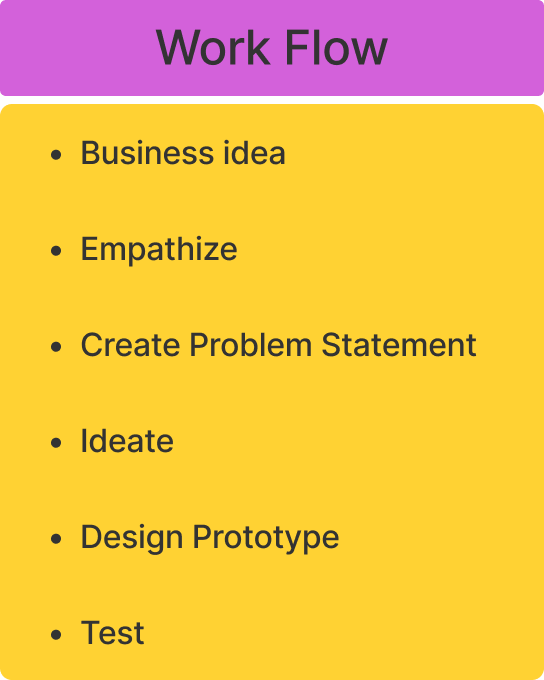
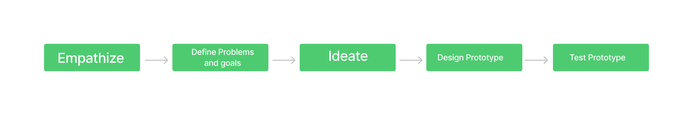
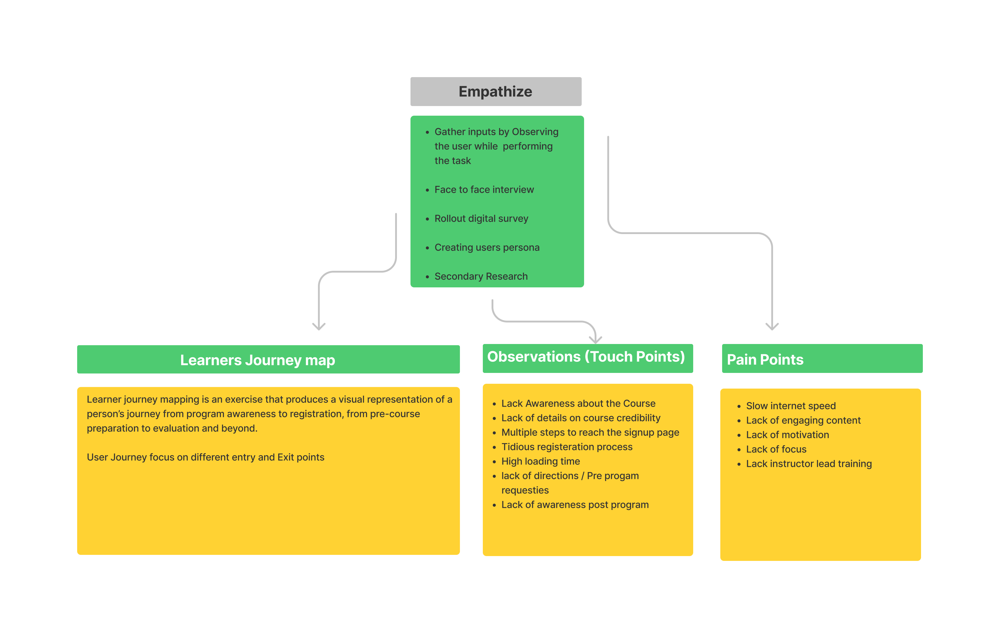
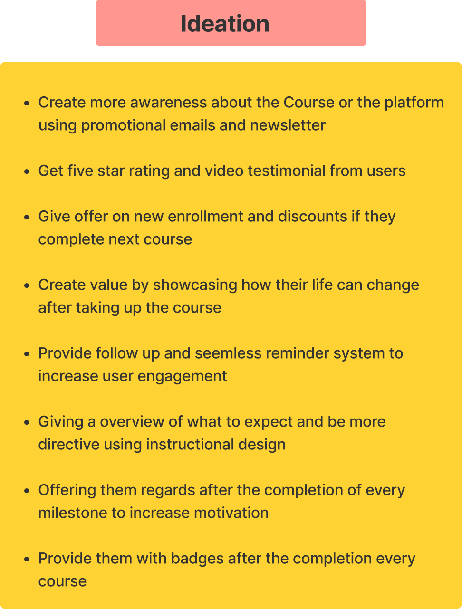
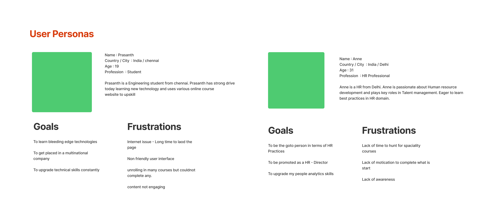

# Work Flow :

Design thinking Methodology was applied to come up with the solution:

## Stages of Design Thinking

###### Stage 1 

###### Stage 2 & 3

###### Stage 4

###### Stage 5 

Goal  - To increase the User Engagement and Completion rate

